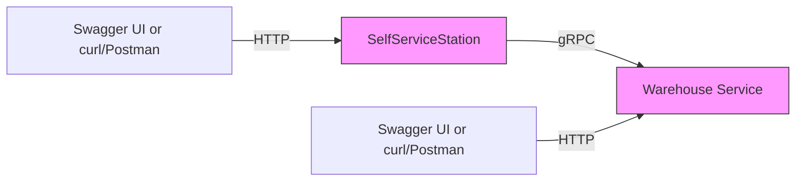

# Pick-up-point
Пример микросервисной архитектуры на основе пункта выдачи заказов

Включает 2 микросервиса:

- **Warehouse** ― складская служба (gRPC + Minimal API + Swagger)
- **SelfServiceStation** ― клиентская станция выдачи заказов (gRPC + Minimal API + Swagger)

И библиотеку классов:
- **Library** ― в ней описан protobuff файл

---

## 🔍 Обзор архитектуры



- **SelfServiceStation** (gRPC-клиент) запрашивает товар у склада.
  - HTTP-минималка на порту `5899` с Swagger-UI (`/swagger`)
  - Имитирует станцию самообслуживания, через нее можно проверить наличие товара и забрать нужный
  - Взаимодействие с Warehouse происходит по gRPC
- **Warehouse**:
  - gRPC-сервис на порту `5990`
  - HTTP-минималка на порту `5999` с Swagger-UI (`/swagger`)
  - По HTTP мы можем проверить каталог, а также добавить новый товар на склад
  - Внутреннее ядро `ApplicationCore` хранит и модифицирует данные.

---

## 🛠 Технологический стек

| Компонент             | Технология                      |
| --------------------- | ------------------------------- |
| Язык                  | C# 12 / .NET 9                  |
| Native AOT компиляция | Включена (AOT Native)           |
| HTTP Framework        | ASP.NET Core Minimal API        |
| gRPC Framework        | Grpc.Core / Grpc.AspNetCore     |
| Сериализация JSON     | `System.Text.Json` (Source-Gen) |
| OpenAPI / Swagger     | Swashbuckle.AspNetCore          |
| Сервер                | Kestrel                         |
| Логирование в консоль | `Console.WriteLine`             |
| Тестирование API      | Swagger-UI, Postman, curl       |

---

## 🚀 Запуск проекта

---

## 📡 HTTP API (Minimal API + Swagger)

### `GET /warehouse/get-catalog`

Возвращает весь каталог продуктов.

- **Response**:
  ```json
  {
    "products": [
      { "id":0, "name":"RTX 3080", "count":5, "category":"ComputerParts" },
      …
    ]
  }
  ```

---

### `POST /warehouse/add`

Добавляет (или инкрементирует) товар на складе.

- **Body** (`application/json`):
  ```json
  {
    "id":6,
    "name":"RTX 4070",
    "count":10,
    "category":"ComputerParts"
  }
  ```
- **Response**:
  - `200 OK` при успехе
  - `400 Bad Request` с `{ type: "about:blank", detail: "..." }` при ошибке валидации


### GET /self-service-station/get-catalog

Возвращает весь каталог продуктов из Warehouse.

**Успешный ответ (200 OK)**

```json
{
  "products": [
    { "id":0, "name":"RTX 3080", "count":5, "category":"ComputerParts" },
    { "id":1, "name":"RTX 3070", "count":10, "category":"ComputerParts" },
    { "id":2, "name":"RTX 3060", "count":15, "category":"ComputerParts" }
  ]
}
```

**Ошибка (503 Service Unavailable)**

```json
{ "type": "about:blank", "detail": "Склад недоступен" }
```

---

### GET /self-service-station/get-product?id={}&count={}

Запрашивает указанный товар и количество у Warehouse.

**Успешный ответ (200 OK)**

```json
{
  "id":1,
  "name":"RTX 3070",
  "count":2,
  "category":"ComputerParts"
}
```

**Ошибка (400 Bad Request)**

```json
{ "type": "about:blank", "detail": "...описание ошибки..." }
```

**Ошибка (503 Service Unavailable)**

```json
{ "type": "about:blank", "detail": "Склад недоступен" }
```

---

## 🤝 gRPC API

- **Endpoint**: `http://localhost:5990` (HTTP/2)
- **Service**: `Warehouse.WarehouseBase`

```protobuf
service Warehouse {
  rpc GetProductCatalog (google.protobuf.Empty) returns (ProductCatalog);
  rpc GetProduct        (GetProductRequest)     returns (Product);
  rpc Ping              (google.protobuf.Empty) returns (google.protobuf.Empty);
}
```

- **GetProductRequest**
  ```proto
  message GetProductRequest {
    int32 ProductId = 1;
    int32 Count     = 2;
  }
  ```
- **ProductCatalog**
  ```proto
  message ProductCatalog {
    repeated Product products = 1;
  }
  ```
- **Product**
  ```proto
  message Product {
    int32 Id                    = 1;
    string Name                 = 2;
    int32 Count                 = 3;
    ProductCategory Category    = 4;
  }

  enum ProductCategory {
    ComputerParts = 0;
    Accessories    = 1;
  }
  ```

---

## ☕ Контакты

- Автор: EgorLis

---
